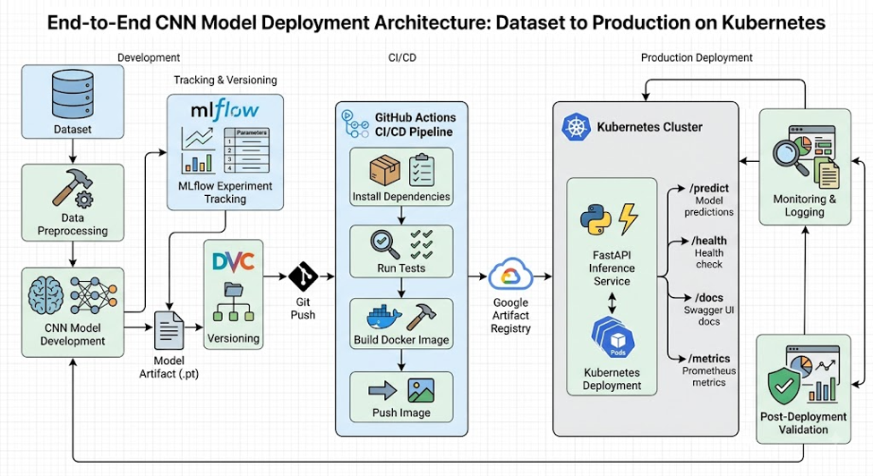

Cats vs Dogs Classification – MLOps Assignment 2
Name: Hari Prasad Joshi
ID: 2024AC05924
Course: Machine Learning Operations (MLOps) AIMLCZG523 Assignment 02

1. Project Overview
This project implements an end-to-end MLOps workflow for binary image classification of cats and dogs.
The objective is to build a CNN-based image classification model and operationalize it using model/data versioning, experiment tracking, automated testing, containerization, CI/CD, Kubernetes deployment, monitoring and post-deployment validation.
The assignment uses a Cats vs Dogs image classification dataset. Images are preprocessed into 224 × 224 RGB format and classified into two classes:
•	Cat 
•	Dog 
The assignment requires an end-to-end workflow covering model development, packaging, CI, deployment and monitoring. 
________________________________________
2. MLOps Workflow
## MLOps Workflow

The following diagram summarizes the end-to-end MLOps workflow implemented for the Cats vs Dogs classification project.

 ________________________________________
3. Technologies Used
Component	Technology
Programming	Python 3.12
Deep Learning	PyTorch
API	FastAPI
Image Processing	Pillow
Experiment Tracking	MLflow
Data/Model Versioning	DVC
Source Control	Git/GitHub
Testing	Pytest
Containerization	Docker
Container Registry	Google Artifact Registry
Deployment	Kubernetes
CI/CD	GitHub Actions
Monitoring	Prometheus client + application counters
API Documentation	FastAPI Swagger
________________________________________
4. Model Development
A CNN model was implemented using PyTorch.
The model contains three convolutional blocks with:
•	Convolution layers 
•	Batch Normalization 
•	ReLU activation 
•	Max Pooling 
The model was retrained for 4 epochs.
Final validation result from the training run:
Epoch 4/4
Train Loss: 0.5277
Train Accuracy: 0.7438
Validation Loss: 0.4833
Validation Accuracy: 0.7672
The trained model was saved as:
models/model.pt
The model artifact is versioned using DVC.
___________________________________
5. DVC Model Versioning
DVC is used to track the trained model artifact.
The model was added using:
dvc add models\model.pt
The artifact was pushed to the configured Google Cloud Storage DVC remote.
Validation:
dvc status
Result:
Data and pipelines are up to date.
Cloud synchronization was also verified:
dvc status --cloud
Result:
Cache and remote 'gcsremote' are in sync.
________________________________________

6. Experiment Tracking
MLflow was used during model training to record the training run.
The 4-epoch training run generated an MLflow Run ID:
3b715019943143a98b3860d1e0de74a4
Training artifacts include:
artifacts/loss_curve.png
artifacts/confusion_matrix.png
artifacts/model.pt
________________________________________
Screenshot – MLflow
 ________________________________________
7. REST API
The trained CNN model is exposed through a FastAPI inference service.
Endpoints
Endpoint	Purpose
/	Service information
/health	Health and model status
/predict	Image classification
/metrics	Prometheus metrics
/docs	Swagger API documentation
The /predict endpoint accepts an image file and returns:
•	filename 
•	predicted label 
•	class probabilities 
•	inference latency 
Example:
{
  "filename": "272.jpg",
  "label": "Dog",
  "probabilities": {
    "Cat": 0.0948,
    "Dog": 0.9052
  },
  "latency_ms": 35.6
}
Screenshot– Swagger
  ________________________________________
8. Automated Testing
Pytest tests cover:
•	API root endpoint 
•	API health endpoint 
•	prediction endpoint 
•	model output shape 
•	prediction probabilities 
•	image validation 
•	training dataset preprocessing 
Final local test result:
7 passed
Tests:
tests/test_api.py
tests/test_model.py
tests/test_preprocessing.py
________________________________________
Screenshot– Pytest
 ________________________________________
9. CI/CD with GitHub Actions
GitHub Actions is used to automate the CI/CD workflow.
The workflow performs activities including:
1.	Checkout source code 
2.	Set up Python 
3.	Install dependencies 
4.	Retrieve required DVC artifacts 
5.	Run automated tests 
6.	Build Docker image 
7.	Push Docker image to Google Artifact Registry 
8.	Deploy the updated image 
9.	Perform deployment validation 
The successful workflow demonstrates automated movement from a source-code change to a deployable container image.
Screenshot– GitHub Actions

Screenshot- Individual workflow steps showing tests/build/image push
  ________________________________________
10. Docker Containerization
The FastAPI inference service is packaged into a Docker image.
The image is published to Google Artifact Registry.
Example image:
asia-south1-docker.pkg.dev/famous-hull-499314-j5/
harimlopsassgn2/harimlopsassgn2-api:
a9cfa0bb75b24b1416f35f148cd704f660b39f46
The image was successfully pushed to Artifact Registry.

Screenshot – Docker/Artifact Registry
________________________________________
11. Kubernetes Deployment
The inference service is deployed to a local Kubernetes cluster.
Kubernetes configuration includes:
deployment/deployment.yaml
deployment/service.yaml
The deployment uses:
•	1 replica 
•	container port 8000 
•	readiness probe 
•	liveness probe 
•	Artifact Registry image 
•	Artifact Registry authentication secret 
The deployment successfully rolled out.
Validation:
kubectl rollout status deployment/cats-dogs-api
Result:
deployment "cats-dogs-api" successfully rolled out
Pod status:
cats-dogs-api-5788ff889d-nhzgz   1/1   Running
________________________________________
Screenshot– Kubernetes
  Screenshot– Kubernetes Deployment image
_____________________________________
12. Health Check
The deployed API was verified using:
curl.exe http://localhost:8002/health
Response:
{
  "status": "healthy",
  "model_loaded": true
}
This confirms that the deployed inference service is running and the trained model has been loaded successfully.
________________________________________
Screenshot – Health Check
 ________________________________________
13. Monitoring 
The inference API implements application-level monitoring using the Prometheus Python client.
The following metrics are tracked:
Request count
cats_dogs_requests_total
Successful predictions
cats_dogs_predictions_total
Failed requests
cats_dogs_errors_total
Request latency
cats_dogs_request_latency_seconds
The /metrics endpoint exposes these metrics in Prometheus format.
The application also records prediction logs containing:
•	filename 
•	predicted label 
•	latency 
•	success/failure 
No sensitive information is logged.
This directly addresses the Assignment 2 M5 requirement to track request count and latency using logs, Prometheus or application counters. 
 
________________________________________
14. Monitoring Results and Logging
After generating prediction requests, the following metrics were observed:
cats_dogs_requests_total 11.0
cats_dogs_predictions_total 11.0
cats_dogs_errors_total 0.0

cats_dogs_request_latency_seconds_count 11.0
cats_dogs_request_latency_seconds_sum 0.5255986
Therefore, during this test session:
Metric	Result
Total prediction requests	11
Successful predictions	11
Failed requests	0
Recorded latency observations	11
Total latency	0.5256 sec
Average latency	≈ 47.8 ms/request
Requests ≤ 50 ms	9/11
Requests ≤ 75 ms	11/11
________________________________________
Screenshot – Prometheus Metrics
Screenshot – Logging 
________________________________________
15. Post-Deployment Model Performance Tracking
A small set of real test images was sent to the deployed inference service.
The true labels were known from their directory/class:
Image	True Label	Predicted	Confidence
Dog/272.jpg	Dog	Dog	90.52%
Dog/6445.jpg	Dog	Dog	89.52%
Dog/10371.jpg	Dog	Dog	81.56%
Cat/272.jpg	Cat	Cat	78.51%
Cat/6445.jpg	Cat	Cat	84.87%
Cat/10371.jpg	Cat	Cat	96.10%
Observed result
Correct predictions = 6
Total predictions   = 6

Observed accuracy = 6/6 = 100%
This is a small post-deployment validation sample, not the overall model accuracy.
The results show that the deployed model correctly classified all six selected validation images.
________________________________________
Screenshot– Post-Deployment Predictions
  ________________________________________
16. Final Git Status
All monitoring changes were committed and pushed.
Latest monitoring commit:
f433c75
Add monitoring and post-deployment metrics
The repository was verified clean:
Your branch is up to date with 'origin/master'.
nothing to commit, working tree clean
________________________________________
Screenshot – Git
 ________________________________________

17. End-to-End MLOps Summary
The completed workflow demonstrates:
 The project therefore demonstrates an end-to-end MLOps lifecycle covering model development, artifact versioning, testing, containerization, CI/CD, deployment, monitoring and post-deployment validation.
________________________________________
18. Limitations and Future Improvements
Limitations
•	Post-deployment performance evaluation uses a small sample of six labelled images. 
•	Monitoring currently tracks operational metrics such as request count, errors and latency. 
•	No long-term production traffic or drift monitoring is available in the local deployment. 
•	The Kubernetes deployment currently uses a single replica. 
Future improvements
•	Deploy Prometheus server and Grafana dashboards for long-term visualization. 
•	Increase the size of the post-deployment labelled validation set. 
•	Add automated model-performance monitoring. 
•	Add data-drift detection. 
•	Add automated model retraining when performance drops. 
•	Increase Kubernetes replicas for improved availability. 
________________________________________
19. Conclusion
This assignment demonstrates an end-to-end MLOps workflow for a Cats vs Dogs CNN classifier.
The trained model was versioned using DVC, tracked with MLflow, tested using Pytest, packaged as a FastAPI service, containerized using Docker, published to Google Artifact Registry and deployed using Kubernetes.
GitHub Actions automates the CI/CD workflow, while application logging and Prometheus-compatible metrics provide basic monitoring of prediction requests, errors and latency.
Post-deployment testing using six labelled images resulted in 6/6 correct predictions, demonstrating successful operation of the deployed inference service on the selected validation sample.

